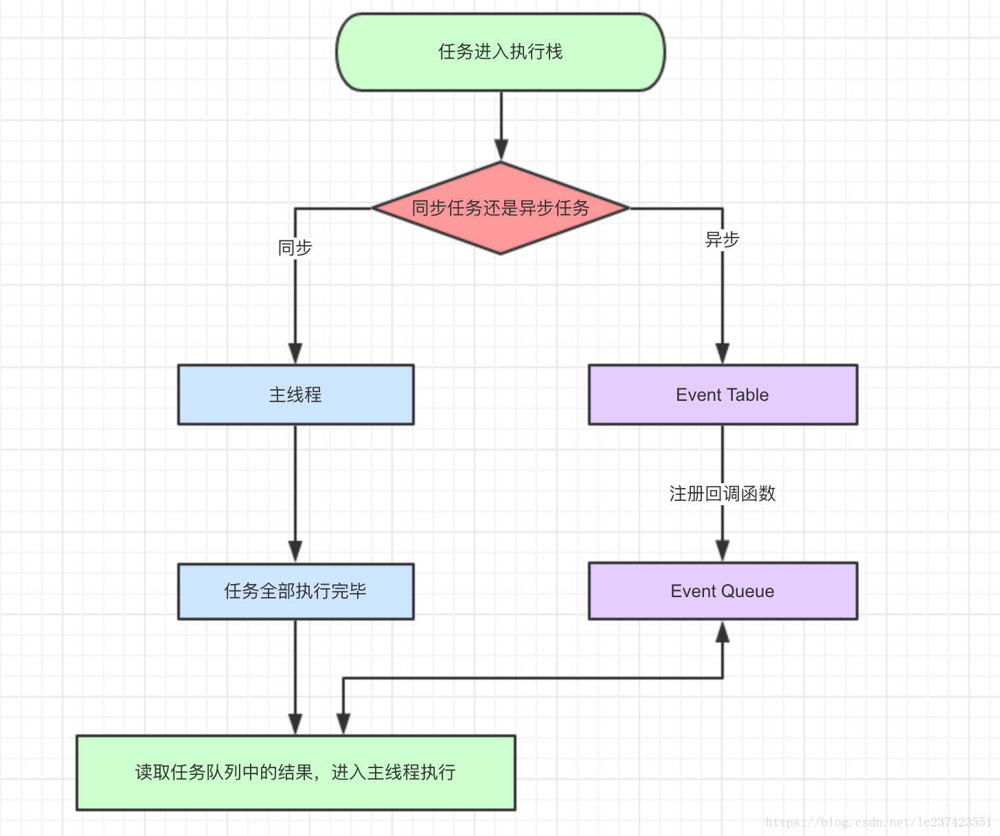
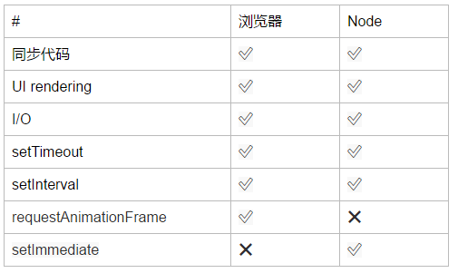

## 什么是宏任务和微任务
    宏任务和微任务都是属于异步任务
    说到宏任务和微任务，我们就不得不提 Event Loop(事件循环) 了
    js本质是单线程，只有执行完当前任务才会执行下一个任务，其本质是：
        1、非阻塞性的任务采取同步的方式，直接在主线程的执行栈完成。
        2、阻塞性的任务都会采用异步来执行，异步的工作一般会交给其他线程完成，然后回调函数会放到事件队列中
    当主线程的任务执行完了(执行栈空了)，JS会去询问事件队列
    执行一个宏任务(先执行同步代码)(相当于去银行办理业务时的"取号操作") ===》 执行所有的微任务("办理业务") ===》 UI render ===》执行下一个宏任务……（等业务办理完（微任务执行完）之后才能办理下一个取号的人（执行下一个宏任务））

## 为什么微任务比宏任务先执行
* 主要是因为事件循环会先判断消息队列中是否有微任务；浏览器端所有的宏任务都在一个时间队列里面执行，事件循环监听着执行栈和消息队列，当执行栈为空时，从消息队列取出一个事件时，如果有微任务，先把微任务执行完，然后才开始执行事件（即宏任务）
  1、宏任务每次只取一个
  2、微任务执行多个
  3、微任务会放在当前时间循环的末尾（这就导致了微任务比宏任务先执行）

## eventLoop事件循环
* 代码开始执行的时候，任务先进入执行栈(call back)中，如果是同步任务，则执行该任务，并输出结果，该任务出栈，执行栈开始执行下一个任务。执行栈在执行时，如果发现该任务是宏任务，那么该宏任务进入宏任务队列，如果是微任务，那么进入微任务队列，当执行栈的任务执行完，执行栈为空时，首先会来到微任务队列中，将微任务放到执行栈中执行，如果在微任务执行的过程中添加微任务，那么添加的微任务也会在本次循环中执行，即在事件循环前调用。当微任务也执行完时，事件循环判断到执行栈和微任务队列都为空，那么将循环到宏任务队列，将宏任务放入执行栈中执行，直到宏任务也执行完，代码就执行完毕
   



## 宏任务和微任务包括哪些
* 宏任务（由宿主：node，浏览器发起）

    

* 微任务（由js引擎发起）

    

* <font color=red>执行的顺序：先同步后异步，先微任务后宏任务</font>

## 案例（同步代码和异步代码）
```
    1 console.log("AAAA");                           同步代码：console.log()
    2 setTimeout(() => console.log("BBBB"), 1000);   setTimeout()是同步代码,定时器里面的代码是异步代码
    3 const start = new Date();                      同步
    4 while (new Date() - start < 3000) {}           同步
    5 console.log("CCCC");                           同步
    6 setTimeout(() => console.log("DDDD"), 0);      外边是同步，定时器里面的代码是异步
    7 new Promise((resolve, reject) => {         new promise的参数是同步，resolve和reject回调函数里面的代码（即then里面的代码)是异步
    8   console.log("EEEE");
    9   foo.bar(100);
    10 })
    11 .then(() => console.log("FFFF"))
    12 .then(() => console.log("GGGG"))
    13 .catch(() => console.log("HHHH"));
    14 console.log("IIII");   同步
```
* 输出结果如下：
``` 
    AAAA
    CCCC
    EEEE
    IIII
    HHHH
    BBBB
    DDDD
```
* 解析（同步任务在线程中执行完，查看事件队列中是否有）
    一开始代码执行，输出AAAA

    第二行代码开启一个计时器t1(一个称呼)，这是一个<font color=red>异步任务且是宏任务</font>，需要等到1秒后提交(进入事件队列中排队等待)。

    第四行是个while语句，需要等待3秒后才能执行下面的代码,这里有个问题，就是3秒后上一个计时器t1的提交时间已经过了，但是线程上的任务还没有执行结束，所以暂时不能打印结果，所以它排在宏任务的最前面了。

    第五行又输出CCCC

    第六行又开启一个计时器t2（称呼），它提交的时间是0秒（其实每个浏览器器有默认最小时间的，暂时忽略），但是之前的t1任务还没有执行，还在等待，所以t2就排在t1的后面。（t2排在t1后面的原因是while造成的）都还需要等待，因为线程上的任务还没执行完毕。(都在事件队列中等待)

    第七行new Promise将执行promise函数，它参数是一个回调函数，这个回调函数内的代码是同步的，它的异步核心在于resolve和reject，同时这个异步任务（resolve，reject）在任务队列中属于<font color=red>微任务</font>，是优先于宏任务执行的，(不管宏任务有多急，反正我是VIP)。所以先直接打印输出同步代码EEEE。第九行中的代码是个不存在的对象，这个错误要抛给reject这个状态（相当于执行了reject回调函数），也就是catch去处理，但是它是<font color=red>异步的且是微任务</font>，只有等到线程上的任务执行完毕，立马执行它，不管宏任务（计时器，ajax等）等待多久了。

    第十四行，这是线程上的最后一个任务，打印输出 IIII

    我们先找出线程上的同步代码，将结果依次排列出来：AAAA CCCC EEEE IIII

    然后我们再找出所有异步任务中的微任务 把结果打印出来 HHHH（执行完线程里面的任务，查看事件队列中的任务是否执行完（即有回调函数），如果有则进入线程）

    最后我们再找出异步中的所有宏任务，这里t1排在前面t2排在后面（这个原因是while造成的），输出结果顺序是 BBBB DDDD

    所以综上 结果是 AAAA CCCC EEEE IIII HHHH BBBB DDDD
