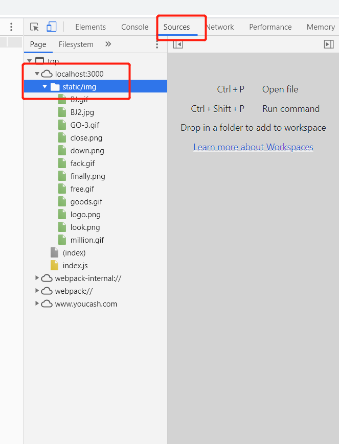

## vue.config.js文件

* 链接：https://www.cnblogs.com/lst619247/p/13554934.html

* 
    chainWebpack: config => {
    config
      .module
      .rule("images")
      .test(/\.(jpg|png|gif)$/)
      .use("url-loader")
      .loader("url-loader")
      .options({
        limit:10,
        // 以下配置项用于配置file-loader
        // 根据环境使用cdn或相对路径
        publicPath: process.env.NODE_ENV === 'production' ? 'https://oss.xx.com/img' : './',
        // 将图片打包到dist/img文件夹下, 不配置则打包到dist文件夹下
        outputPath: 'static/img',
        // 配置打包后图片文件名
        name: '[name].[ext]',
      })
      .end();
}

* 注意outputPath的设置：一般是设置static/…… ， 因为项目跑起来是，图片都是放在浏览器的source下面的static/img文件夹里面，所以这里的值也就是浏览器上source下面图片的路径，这里的路径就是static/img，如下图：

* 注意：如果项目里面有图片是通过background-image：url() 引入的，那么在设置图片cdn时，图片不显示，解决方法：将extract的值改为false

 css: {
    modules: false,

    extract: false,    // 将这里的改为false

    sourceMap: false,

    loaderOptions: {
      css: {},
      postcss: {},
      stylus: {
        'resolve url': true,
        'import': []
      }
    }
  }

  css: {
    //注意,配置后将会自动将class里的css的px全部转为rem,style样式不转
    //使用需要下载转换包npm i postcss-pxtorem
    loaderOptions: {
      postcss: {
        plugins: [
          require('postcss-pxtorem')({
            rootValue: 50, // 根字体大小,换算的基数
            selectorBlackList: [], 
            propList: ['*']
          })
        ]
      }
    },
    // 是否使用css分离插件 ExtractTextPlugin
    //css 添加版本号
    extract: {
      //一种方式，打包后的css 会带版本号，不改变文件名的。
      filename: 'css/[name].css?v=' + Version,
      chunkFilename: 'css/[name].css?v=' + Version,
    }
