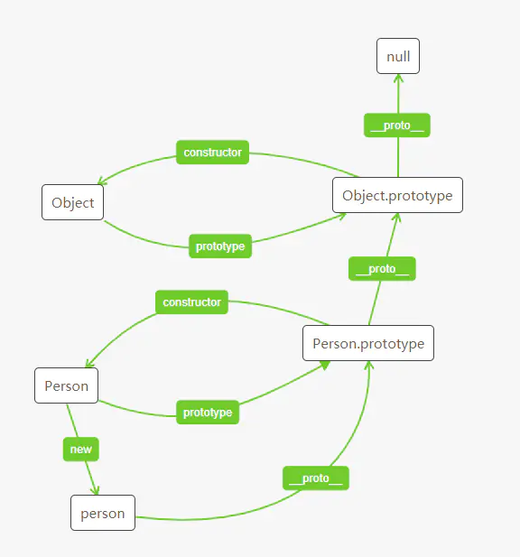

## 原型链图解



## 原型链
* 原型链实现原理：假如现在有一个函数M，现需要给M增加一个say方法，若是直接在M函数中进行声明this.say = say，则在构造实例的时候，都会进行copy创建一次say，这会增加内存的使用。因此可以考虑在M函数的原型prototype上增加say方法，提供给创建的实例进行使用。在实例进行调用此方法时，会通过原型一层层去进行寻找

* 原型链：每一个对象都有一个__proto__指向自身的原型，而原型也是对象，也有自己的__proto__指向自己的原型，以此类推形成链式结构，称之为原型链
  每定义一个函数数据类型(普通函数，类……)，都会带有一个属性prototype，指向函数的原型对象，原型对象有一个constructor属性，指向函数；通过函数new一个对象，对象带有__proto__属性，指向函数的原型对象

* 原型链访问规则：访问对象的成员，如果没有，访问原型对象，如果还是没有，如果还是没有，就继续往上找，一直找到原型链的重点null，如果最终还是没有找到，是对象则会包undefined，如果是方法，则报错XXX xxx is not defined

* filter实现的原理
```
  Array.prototype.filter = function (fn){
      let newArr = [];
      for(var i=0;i < this.length;i++){
          fn(this[i]) && newArr.push(this[i])
      }
      return newArr;
  }
  var result = [1,2,3,4,5].filter((item)=>{
      return item > 2
  })
  console.log(result);

  function filter(arr,fn){
      let res = [];
      for(var i=0;i < arr.length;i++){
          fn(arr[i]) && res.push(arr[i])
      }
      return res
  }
  filter([1,2,3,4,5],function(item){return item>2})
  ```

  这里运用到了原型链，将filter存放到数组的原型对象上面，arr.filter()调用的时候，会现在自身上找，如果找不到，则到原型对象上面找，this指向的是当前调用者(即[1,2,3,4,5])